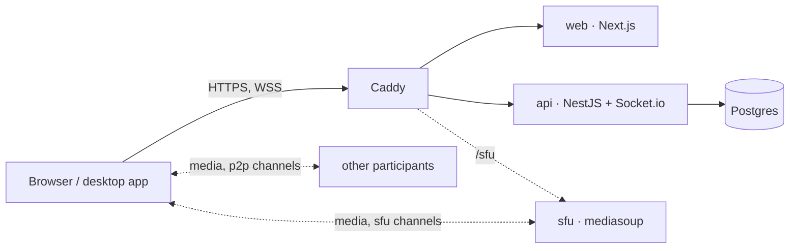

<br>
<br>

<p align="center">
  <picture>
    <source media="(prefers-color-scheme: dark)" srcset="docs/assets/logo-dark.svg">
    
  </picture>
</p>

<h1 align="center">relay</h1>

<p align="center">
  Self-hosted voice, video and chat for a small group of people.<br>
  One server, one command, and it is yours.
</p>

<p align="center">
  <a href="https://github.com/frizzonje/relay/actions/workflows/ci.yml"></a>
  <a href="https://github.com/frizzonje/relay/tags"></a>
  <a href="https://github.com/frizzonje/relay/releases"></a>
  <a href="LICENSE"></a>
</p>

<p align="center">
  <a href="#install">Install</a> ·
  <a href="#features">Features</a> ·
  <a href="#how-it-works">How it works</a> ·
  <a href="docs/README.md">Docs</a> ·
  <a href="README.ru.md">Русский</a>
</p>

---

relay is a Discord-style app you run on your own server: servers and channels,
voice rooms with video and screen sharing, text chat with history, direct
messages and one-to-one calls. It is built for friends and small teams, runs on
a 1 GB VPS, and needs no accounts — people sign in with a key their device
generates.

## Features

**Calls**
- Voice channels with camera, screen sharing (with system audio), push-to-talk,
  voice activation, mute/deafen and a per-person volume mixer up to 300 %.
- Two transports per channel: direct **P2P mesh** for small rooms, a
  **mediasoup SFU** for larger ones. [Details](#how-it-works).
- Direct 1:1 calls from a DM with ring / accept / decline and missed-call marks.
- Guest invite links into a single voice channel, optionally listen-only.
- TURN (coturn) for people behind strict NAT and mobile networks.

**Chat**
- Text channels with replies, edits, reactions, attachments up to 25 MB,
  spoilers and typing indicators.
- History in Postgres for a configurable period (14 days by default), loaded
  page by page.
- Full-text search across a channel or a whole server.
- `@mentions` bound to a person's key, not their nickname.
- Pinned messages, which outlive the retention period.
- Direct messages between two people.

**People and access**
- One shared password to enter the installation.
- No registration: a person is an Ed25519 key kept on their device. Link more
  devices with a 6-digit code.
- Installation-wide presence: online, in a call, recently away.
- Password-protected servers, per-server moderation, installation-wide bans,
  IP/CIDR blocking.
- An owner panel with ~100 settings, people and devices, bans, an audit log
  and maintenance tools — no restarts, no config editing.

**Clients**
- Web, the reference client, in English and Russian.
- Desktop apps for Windows, macOS and Linux with tray, autostart, auto-updates
  and a global push-to-talk hotkey (Windows, macOS).

## Install

On a fresh **Debian or Ubuntu** server:

```bash
curl -fsSL https://raw.githubusercontent.com/frizzonje/relay/main/install.sh | bash
```

The installer sets up Docker, asks for a domain, a login password and whether
you want TURN and the media server, pulls prebuilt images, opens the firewall,
starts the stack in `/opt/relay` and prints an owner link. No domain is fine —
you get a Let's Encrypt certificate for the server's IP.

**Server:** 1 CPU, 1 GB RAM, **2 GB swap**, ~3 GB disk. The stack is tuned for
exactly that. Give the media server 2 cores if you expect video calls of 4+.

Day to day you use the `relay` CLI:

```bash
relay update            # newest release; relay update 1.2.3 rolls back
relay logs api          # follow a service's logs
relay backup            # database, volumes and config in one archive
relay restore <file>
relay owner-link        # a one-time link that makes you the owner
relay config            # edit .env, then: relay up
```

The settings that live in `/opt/relay/.env` (everything else is in the owner
panel):

| Variable | Default | Meaning |
|---|---|---|
| `SITE_PASSWORD` | empty | login password; empty means open. A password set in the owner panel takes precedence |
| `POSTGRES_PASSWORD` | — | required, generated by the installer; read once when the volume is created |
| `RETENTION_DAYS` | `14` | message history: days, `0`/`forever`, or `ephemeral`. Seeds the panel setting on first start |
| `DOMAIN` | `localhost` | Caddy hostname; a real domain gets Let's Encrypt |
| `SERVER_HOST` | `localhost` | public address for ICE candidates and coturn |
| `TURN_SECRET` | empty | shared by api and coturn for short-lived TURN credentials (`--profile turn`) |
| `TURN_EXTERNAL_IP` | empty | public IP when the VM sits behind 1:1 NAT |
| `SFU_SECRET` | empty | shared by api and sfu; empty turns the `sfu` mode off |
| `SFU_ANNOUNCED_IP` | `TURN_EXTERNAL_IP` | public IP in the media server's candidates |
| `RELAY_VERSION` | `latest` | image tag; the installer pins it, `relay update` moves it |

Ports: `80`, `443` TCP; with TURN `3478` UDP+TCP, `5349` TCP, `49160–49200` UDP;
with the SFU `40000–40100` UDP+TCP.

Full guide — every variable, updates, backups, the owner panel:
[docs/self-hosting.md](docs/self-hosting.md) (Russian). Prefer to read the
script before piping it into a shell:
`curl -fsSLO https://raw.githubusercontent.com/frizzonje/relay/main/install.sh && less install.sh`.

## How it works



Everything sits behind one origin. `api` handles sign-in, the channel
registry, chat, presence and call signaling; `web` is the UI; `sfu` and
`coturn` are optional compose profiles.

Each voice channel picks its transport:

| | `p2p` (default) | `sfu` |
|---|---|---|
| Media path | directly between participants | through the media server |
| Upload per person | N−1 streams | 1 stream |
| Good for | 2–3 with video, ~6 voice-only | 4+ with video |
| Server cost | signaling only | CPU and UDP ports |
| Needs | nothing | `--profile sfu` and `SFU_SECRET` |

If the media server goes down, an `sfu` channel says so and reconnects on its
own when it is back; it does not quietly fall back to P2P.

### Privacy

relay is **not** end-to-end encrypted. It gives you a server you control.

| | In transit | Readable on the server |
|---|---|---|
| Browser ↔ server | TLS | — |
| Calls in a `p2p` channel | DTLS-SRTP, peer to peer | no |
| Calls in an `sfu` channel | DTLS-SRTP to the media server | yes, the SFU decrypts to route |
| Messages and files | TLS | yes, stored in plain form |

Whoever has root on the server can read the text. That is what makes search,
moderation and readable history possible. Why E2EE is not in 1.x:
[docs/plans/old/relay-1.0.md](docs/plans/old/relay-1.0.md).

## Clients

| Platform | Code | Stack | Status |
|---|---|---|---|
| Web | [`apps/web`](apps/web) | Next.js 15, React 19 | reference client |
| Windows, macOS | [`clients/desktop`](clients/desktop) | Tauri v2 | MSI/NSIS, dmg |
| Linux | [`clients/desktop-linux`](clients/desktop-linux) | Electron | AppImage, PKGBUILD for Arch |
| iOS | [`clients/ios`](clients/ios) | SwiftUI + libwebrtc | prototype, predates protocol v1 |
| Android | — | — | not started |

Desktop builds are on the [Releases](https://github.com/frizzonje/relay/releases)
page (`desktop-v*` tags, `nightly` from `main`). They are not code-signed yet,
so SmartScreen and Gatekeeper warn on first launch. Linux uses Electron because
distro WebKitGTK ships without WebRTC —
[details](clients/desktop-linux/README.md).

## Development

The JS side is a pnpm + Turborepo monorepo. Everything runs in Docker; you do
not need Node on the host.

```bash
docker compose -f infra/docker-compose.dev.yml up    # → https://localhost, hot reload
```

Open it in two browser profiles, pick different names, join the same voice
channel. Add `--profile sfu` for the media server. The dev stack has no login
password and a self-signed certificate.

```
apps/web        Next.js UI
apps/api        NestJS: REST, Socket.io, Postgres
apps/sfu        mediasoup media server
packages/shared @relay/shared — the client/server contract
clients/        desktop (Tauri), desktop-linux (Electron), ios
infra/          Caddy, coturn, relay CLI, dev and e2e compose files
e2e/            Playwright tests on the production stack
```

Tests, lint, e2e and conventions: [CONTRIBUTING.md](CONTRIBUTING.md).

## Documentation

Technical docs are in Russian and link straight into the code.

- [Architecture](docs/architecture.md) — start here
- [Protocol](docs/protocol.md) — every REST route and Socket.io event
- [Media](docs/media.md) — mesh, SFU, TURN
- [Backend](docs/backend.md) · [Frontend](docs/frontend.md)
- [Self-hosting](docs/self-hosting.md)
- [Changelog](CHANGELOG.md)

## License

[MIT](LICENSE)
