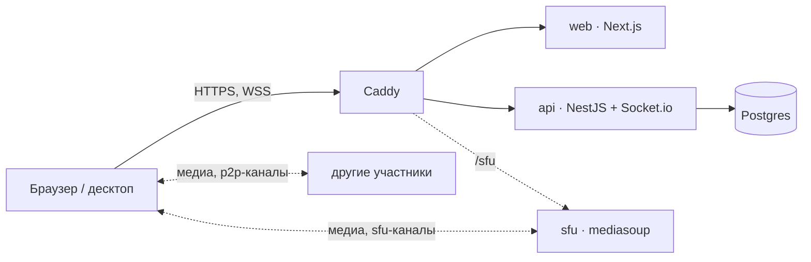

<p align="center">
  <picture>
    <source media="(prefers-color-scheme: dark)" srcset="docs/assets/logo-dark.svg">
    
  </picture>
</p>

<h1 align="center">relay</h1>

<p align="center">
  Свой голос, видео и чат для небольшой компании.<br>
  Один сервер, одна команда — и всё ваше.
</p>

<p align="center">
  <a href="https://github.com/frizzonje/relay/actions/workflows/ci.yml"></a>
  <a href="https://github.com/frizzonje/relay/tags"></a>
  <a href="https://github.com/frizzonje/relay/releases"></a>
  <a href="LICENSE"></a>
</p>

<p align="center">
  <a href="#установка">Установка</a> ·
  <a href="#возможности">Возможности</a> ·
  <a href="#как-устроено">Как устроено</a> ·
  <a href="docs/README.md">Документация</a> ·
  <a href="README.md">English</a>
</p>

---

relay — приложение в духе Discord, которое живёт на вашем сервере: серверы и
каналы, голосовые комнаты с видео и демонстрацией экрана, текстовый чат с
историей, личные сообщения и звонки один на один. Рассчитан на друзей и
небольшие команды, работает на VPS с 1 ГБ памяти и обходится без аккаунтов —
человек входит ключом, который создаёт его устройство.

## Возможности

**Звонки**
- Голосовые каналы с камерой, демонстрацией экрана (со звуком), push-to-talk,
  активацией голосом, мутом/глушилкой и микшером громкости до 300 % на человека.
- Два транспорта на выбор для каждого канала: прямой **P2P mesh** для маленьких
  комнат и **медиасервер mediasoup** для больших. [Подробнее](#как-устроено).
- Звонки один на один из ЛС: вызов, ответ, отклонение, отметки о пропущенных.
- Гостевые ссылки в один голосовой канал, можно «только слушать».
- TURN (coturn) для строгих NAT и мобильного интернета.

**Чат**
- Текстовые каналы: ответы, правка, реакции, вложения до 25 МБ, спойлеры,
  «печатает…».
- История в Postgres на настраиваемый срок (по умолчанию 14 дней), подгружается
  страницами.
- Полнотекстовый поиск по каналу или по всему серверу.
- `@упоминания`, привязанные к ключу человека, а не к нику.
- Закреплённые сообщения — их не удаляет срок хранения.
- Личные сообщения.

**Люди и доступ**
- Один общий пароль на вход в инсталляцию.
- Без регистрации: человек — это Ed25519-ключ на его устройстве. Второе
  устройство связывается 6-значным кодом.
- Присутствие на всю инсталляцию: в сети, в звонке, только что был.
- Серверы под паролем, модерация по серверам, баны на всю инсталляцию,
  блокировка по IP/CIDR.
- Панель владельца: около сотни настроек, люди и устройства, баны, журнал,
  обслуживание — без перезапусков и правки конфигов.

**Клиенты**
- Веб — эталонный клиент, на русском и английском.
- Десктоп для Windows, macOS и Linux: трей, автозапуск, автообновления,
  глобальный хоткей push-to-talk (Windows, macOS).

## Установка

На чистом сервере **Debian или Ubuntu**:

```bash
curl -fsSL https://raw.githubusercontent.com/frizzonje/relay/main/install.sh | bash
```

Установщик ставит Docker, спрашивает домен, пароль входа, нужны ли TURN и
медиасервер, скачивает готовые образы, открывает порты, поднимает стек в
`/opt/relay` и печатает ссылку владельца. Домена нет — получите сертификат
Let's Encrypt на IP сервера.

**Сервер:** 1 ядро, 1 ГБ RAM, **2 ГБ swap**, ~3 ГБ диска — стек настроен ровно
под это. Для видеозвонков на 4+ через медиасервер лучше 2 ядра.

Дальше — CLI `relay`:

```bash
relay update            # на свежую версию; relay update 1.2.3 — откат
relay logs api          # логи сервиса
relay backup            # база, тома и конфиг одним архивом
relay restore <файл>
relay owner-link        # одноразовая ссылка, делающая вас владельцем
relay config            # правка .env, затем relay up
```

Полное руководство — обновления, `.env`, порты, бэкапы, панель владельца:
[docs/self-hosting.md](docs/self-hosting.md). Прочитать скрипт перед запуском:
`curl -fsSLO https://raw.githubusercontent.com/frizzonje/relay/main/install.sh && less install.sh`.

## Как устроено



Всё за одним origin. `api` отвечает за вход, реестр каналов, чат, присутствие и
сигналинг звонков; `web` — интерфейс; `sfu` и `coturn` — необязательные
профили compose.

Транспорт выбирается для каждого голосового канала:

| | `p2p` (по умолчанию) | `sfu` |
|---|---|---|
| Путь медиа | напрямую между участниками | через медиасервер |
| Исходящих потоков у человека | N−1 | 1 |
| Хорошо для | 2–3 с видео, ~6 только голосом | 4+ с видео |
| Нагрузка на сервер | только сигналинг | CPU и UDP-порты |
| Нужно | ничего | `--profile sfu` и `SFU_SECRET` |

Если медиасервер упал, `sfu`-канал говорит об этом и сам переподключается, когда
тот вернётся; молча на P2P он не переходит.

### Приватность

relay — **не** сквозное шифрование. Он даёт сервер, который контролируете вы.

| | В пути | Читается на сервере |
|---|---|---|
| Браузер ↔ сервер | TLS | — |
| Звонки в `p2p`-канале | DTLS-SRTP напрямую | нет |
| Звонки в `sfu`-канале | DTLS-SRTP до медиасервера | да, SFU расшифровывает, чтобы маршрутизировать |
| Сообщения и файлы | TLS | да, хранятся открытым текстом |

Кто имеет root на сервере, тот читает переписку — поэтому возможны поиск,
модерация и история для новичков. Почему E2EE нет в 1.x —
[docs/plans/old/relay-1.0.md](docs/plans/old/relay-1.0.md).

## Клиенты

| Платформа | Код | Стек | Статус |
|---|---|---|---|
| Веб | [`apps/web`](apps/web) | Next.js 15, React 19 | эталонный клиент |
| Windows, macOS | [`clients/desktop`](clients/desktop) | Tauri v2 | MSI/NSIS, dmg |
| Linux | [`clients/desktop-linux`](clients/desktop-linux) | Electron | AppImage, PKGBUILD для Arch |
| iOS | [`clients/ios`](clients/ios) | SwiftUI + libwebrtc | прототип, протокол до 1.0 |
| Android | — | — | не начат |

Сборки десктопа — на странице [Releases](https://github.com/frizzonje/relay/releases)
(теги `desktop-v*`, `nightly` — из `main`). Подписи кода пока нет, SmartScreen и
Gatekeeper предупреждают при первом запуске. На Linux — Electron, потому что
дистрибутивный WebKitGTK собран без WebRTC —
[подробности](clients/desktop-linux/README.md).

## Разработка

JS-часть — монорепо pnpm + Turborepo. Всё работает в Docker, Node на машине не
нужен.

```bash
docker compose -f infra/docker-compose.dev.yml up    # → https://localhost, hot reload
```

Откройте в двух профилях браузера, выберите разные имена, зайдите в один
голосовой канал. `--profile sfu` поднимет медиасервер. В dev-стеке нет пароля
входа, сертификат самоподписанный.

```
apps/web        интерфейс на Next.js
apps/api        NestJS: REST, Socket.io, Postgres
apps/sfu        медиасервер mediasoup
packages/shared @relay/shared — контракт клиент↔сервер
clients/        desktop (Tauri), desktop-linux (Electron), ios
infra/          Caddy, coturn, relay CLI, compose для dev и e2e
e2e/            Playwright-тесты на прод-стеке
```

Тесты, линт, e2e и соглашения — [CONTRIBUTING.md](CONTRIBUTING.md).

## Документация

- [Архитектура](docs/architecture.md) — начать отсюда
- [Протокол](docs/protocol.md) — все REST-маршруты и Socket.io-события
- [Медиа](docs/media.md) — mesh, SFU, TURN
- [Бэкенд](docs/backend.md) · [Фронтенд](docs/frontend.md)
- [Своя инсталляция](docs/self-hosting.md)
- [Changelog](CHANGELOG.md)

## Лицензия

[MIT](LICENSE)
