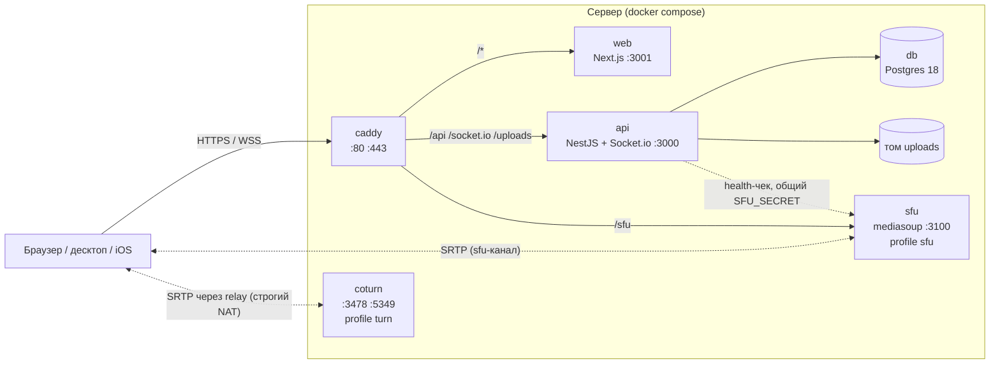

# Архитектура

С чего начать, если вы впервые открыли репозиторий. Здесь — из каких частей
состоит relay, как они разговаривают и где что лежит. Детали — в
[protocol.md](protocol.md) (контракт), [media.md](media.md) (звонки),
[backend.md](backend.md), [frontend.md](frontend.md) и
[self-hosting.md](self-hosting.md).

## Сервисы



| Сервис | Код | Что делает | Состояние |
|---|---|---|---|
| **caddy** | [`infra/Caddyfile`](../infra/Caddyfile) | TLS (Let's Encrypt / внутренний CA), один origin для всего | сертификаты в томе `caddy_data` |
| **web** | [`apps/web`](../apps/web) | Next.js 15, весь UI. Сам ничего не хранит, [`middleware.ts`](../apps/web/middleware.ts) не пускает без `relay_pass` | нет |
| **api** | [`apps/api`](../apps/api) | REST + Socket.io: вход, личности, реестр, чат, ЛС, сигналинг звонков, дозвон, настройки, панель владельца | Postgres + том `uploads` + память процесса |
| **db** | `postgres:18-alpine` | всё постоянное | том `pgdata` |
| **sfu** | [`apps/sfu`](../apps/sfu) | медиасервер для каналов `sfu`. Необязателен | только память |
| **coturn** | [`infra/coturn-entrypoint.sh`](../infra/coturn-entrypoint.sh) | TURN для строгих NAT. Необязателен | нет |

`sfu` и `coturn` работают в `network_mode: host` — им нужны диапазоны UDP-портов.
Стек целиком — [`docker-compose.yml`](../docker-compose.yml) (сборка из исходников)
и [`docker-compose.prod.yml`](../docker-compose.prod.yml) (готовые образы GHCR).

**api — один процесс, горизонтально не масштабируется.** Часть состояния живёт
в его памяти (ниже), и это осознанный выбор под маленькую инсталляцию.

## Три вопроса на входе

Каждый запрос проходит три независимые проверки. Их важно не путать.

| Вопрос | Чем отвечается | Где |
|---|---|---|
| **Пустить ли на инсталляцию?** | общий пароль → кука `relay_pass` (HMAC, без базы) | [`auth/auth.ts`](../apps/api/src/auth/auth.ts), [`http-gate.ts`](../apps/api/src/http-gate.ts), [`middleware.ts`](../apps/web/middleware.ts) |
| **Кто это?** | Ed25519-ключ устройства → челлендж → кука `relay_id` | [`identity/`](../apps/api/src/identity/), [`lib/signer.ts`](../apps/web/lib/signer.ts) |
| **Что ему здесь можно?** | бан, маска адреса, обслуживание, пароль закрытого сервера, гость, лимитер | [`gateway/perimeter.ts`](../apps/api/src/gateway/perimeter.ts) |

Пароль инсталляции — это ворота, а не учётная запись. Личность — это ключ на
устройстве: нет регистрации, пароля и восстановления. Потерял все устройства —
заводишь новую личность. Несколько устройств одной личности связываются
6-значным кодом ([protocol.md §2.3](protocol.md#23-устройства-и-связка)).

Отдельно от этого — **владелец инсталляции**: одна личность, получившая власть
по ссылке из терминала сервера (`relay owner-link`). Он видит панель и может
всё; модератор сервера — власть только над своим сервером.

## Контракт и его копии

```
packages/shared  (@relay/shared)      ← web импортирует напрямую
     ▲
     │  тесты сверяют строки и числа
     │
apps/api/src/…  «близнецы»            ← api НЕ зависит от @relay/shared
apps/sfu        свой маленький протокол ← с web/lib/voice/sfu/protocol.ts
```

[`packages/shared`](../packages/shared/src) — источник правды для клиентов:
socket-события, DTO, константы, каталог настроек, машина состояний вызова,
крипто-примитивы личности. Web импортирует его как есть.

**api пакет не импортирует** — он держит копии того, что ему нужно:

| В shared | Копия в api |
|---|---|
| [`index.ts`](../packages/shared/src/index.ts) — константы, типы ответов, причины отказов | [`gateway/protocol.ts`](../apps/api/src/gateway/protocol.ts) |
| [`settings.ts`](../packages/shared/src/settings.ts) — каталог настроек | [`settings/catalog.ts`](../apps/api/src/settings/catalog.ts) |
| [`ring.ts`](../packages/shared/src/ring.ts) — машина состояний вызова | [`gateway/ring-machine.ts`](../apps/api/src/gateway/ring-machine.ts) |
| [`identity.ts`](../packages/shared/src/identity.ts) — ключи, отпечатки | [`identity/crypto.ts`](../apps/api/src/identity/crypto.ts) |
| [`auth.ts`](../packages/shared/src/auth.ts) — токены на Web Crypto (для Edge-middleware Next) | [`auth/auth.ts`](../apps/api/src/auth/auth.ts) — на `node:crypto` |

Расхождение копий ловят тесты в `packages/shared`: они читают исходники api и
сравнивают — [`index.test.ts`](../packages/shared/src/index.test.ts),
[`settings.test.ts`](../packages/shared/src/settings.test.ts),
[`ring.test.ts`](../packages/shared/src/ring.test.ts),
[`consumers.test.ts`](../packages/shared/src/consumers.test.ts) (каждый параметр
каталога кем-то читается). Меняете контракт — правите обе половины и
[protocol.md](protocol.md), иначе CI покраснеет.

Нативные клиенты (`clients/`) не могут импортировать TS и реализуют контракт по
[protocol.md](protocol.md). Web — эталонная реализация.

## Где живёт состояние

| Что | Где | Переживает рестарт api |
|---|---|---|
| Серверы, каналы | Postgres `servers`, `channels` (+ копия в памяти `RegistryService`) | да |
| Сообщения, реакции, закрепы, упоминания | Postgres `messages`, `pins`; срок — ретенция | да |
| Вложения | файлы в томе `uploads`, строки в `attachments` | да |
| Личности, устройства, роли и баны | `identities`, `devices`, `roles`, `owner_claims` | да |
| Беседы ЛС | `conversations` (сообщения — в `messages`) | да |
| Отметки чтения, личные настройки | `reads`, `prefs` | да |
| Настройки инсталляции, журнал | `settings`, `audit` | да |
| `relay_pass` | нигде — проверяется подписью | — |
| Сессии `relay_id` | нигде — ключ подписи случайный на процесс | **нет**: клиент молча входит заново |
| Кто в какой комнате, presence, живые вызовы | память api (комнаты Socket.io, `VoiceSessions`, `Presence`, `Rings`) | нет |
| Нонсы входа, коды связки, счётчики попыток | память api | нет |
| Микрофон, камера, хоткеи, громкость по умолчанию | `localStorage` устройства | — |

Схема БД — [`db/entities.ts`](../apps/api/src/db/entities.ts), миграции —
[`db/migrations/`](../apps/api/src/db/migrations/) (применяются на старте api,
[`main.ts`](../apps/api/src/main.ts)).

## Звонки в двух словах

- Голосовой канал `p2p`: api только пересылает SDP/ICE, медиа идёт напрямую между
  участниками (full mesh, perfect negotiation).
- Голосовой канал `sfu`: api выдаёт 60-секундный пропуск, клиент подключается к
  mediasoup напрямую по `/sfu/`, api в медиа не участвует.
- Звонок 1:1 из ЛС — дозвон через api, после ответа двое садятся в отдельную
  комнату `voice:dm-…`, всегда `p2p`.
- TURN — для тех, у кого прямой путь не собирается.

Подробно — [media.md](media.md).

## Клиенты

| Платформа | Каталог | Как устроен |
|---|---|---|
| Web | [`apps/web`](../apps/web) | эталон |
| Windows, macOS | [`clients/desktop`](../clients/desktop) | Tauri v2: окно грузит web-UI с сервера, Rust добавляет трей, PTT-хоткей, автозапуск, обновления, ключ в keychain |
| Linux | [`clients/desktop-linux`](../clients/desktop-linux) | Electron поверх того же web-UI — в дистрибутивном WebKitGTK нет WebRTC |
| iOS | [`clients/ios`](../clients/ios) | SwiftUI + libwebrtc, прототип под протокол до 1.0 (подробнее — [clients/README.md](../clients/README.md)) |

Обе десктоп-оболочки говорят с web-UI одним набором событий
([`lib/shell-bridge.ts`](../apps/web/lib/shell-bridge.ts)); списки —
[`capabilities/remote.json`](../clients/desktop/src-tauri/capabilities/remote.json)
и [`desktop-linux/src/events.js`](../clients/desktop-linux/src/events.js).

## Карта репозитория

```
apps/
  web/            Next.js 15 — UI                                   → frontend.md
  api/            NestJS 11 — REST, Socket.io, Postgres             → backend.md
  sfu/            NestJS 11 + mediasoup — медиасервер               → media.md
packages/
  shared/         @relay/shared — контракт клиент↔сервер            → protocol.md
clients/
  desktop/        Tauri v2 (Windows, macOS)
  desktop-linux/  Electron (Linux)
  ios/            Swift / SwiftUI
infra/            Caddyfile, TLS-режимы, coturn, relay CLI, dev/e2e compose
e2e/              Playwright: сценарии двумя людьми на прод-стеке
tools/            gen-sfx.py (звуки), keyprobe (проба ключей в движках), check-docs.mjs
docs/             эта документация; plans/ — проектные заметки по релизам
install.sh        установщик одной командой
```
