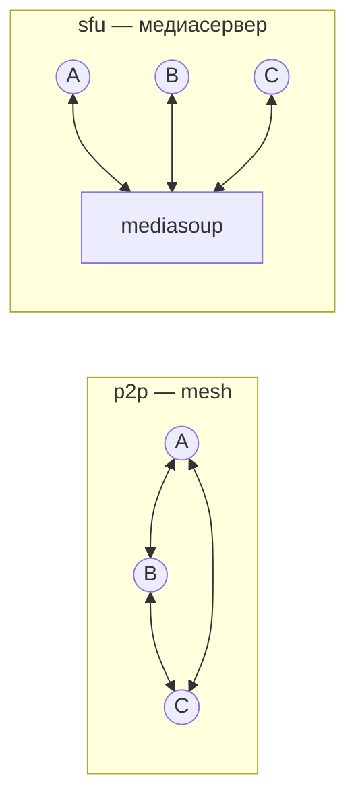

# Медиа: mesh, SFU, TURN

Как в relay едут звук, видео и демонстрация экрана. Сигналинг (события `join`,
`offer`, `sfu-token`, …) описан в [protocol.md §9](protocol.md#9-голосовые-комнаты);
здесь — что происходит на уровне WebRTC и где это лежит в коде.

## Два транспорта

У каждого голосового канала есть `mode` — `p2p` или `sfu`. Каналы, которые
появляются вместе с новым сервером, всегда `p2p`; у созданных вручную режим
переключает их владелец (`channel-mode`), умолчание — `spaces.defaultVoiceMode`.

| | `p2p` | `sfu` |
|---|---|---|
| Путь медиа | напрямую между участниками (или через TURN) | через сервис `sfu` |
| Исходящих потоков у участника | N−1 | 1 |
| Хорошо для | 2–3 с видео, до ~6–7 только голосом | 4+ с видео |
| Нагрузка на сервер | только сигналинг | CPU и UDP/TCP-порты `40000–40100` |
| Нужно | ничего | `--profile sfu` и `SFU_SECRET` |
| Сервер видит медиа | нет | да — SFU расшифровывает, чтобы маршрутизировать |

Транспорт выбирает клиент по ответу `sfu-token` (web — `requestRoute` и
`enterRoom` в [`lib/voice.ts`](../apps/web/lib/voice.ts)):

- `not-sfu` → mesh;
- `{token, url}` → медиасервер;
- `unavailable` → канал `sfu`, но медиасервер не отвечает на health-чек api
  ([`sfu-health.ts`](../apps/api/src/sfu/sfu-health.ts)). Клиент остаётся в
  комнате без медиа и повторяет запрос с паузой 5 → 10 → 20 → 30 с. На mesh
  **не откатывается** (с 2.0.1): откат по одному человеку раскалывал комнату на
  два транспорта, которые друг друга не слышат.

## Клиентская архитектура

Всё голосовое на вебе — в [`apps/web/lib/voice.ts`](../apps/web/lib/voice.ts)
(«дирижёр») и [`apps/web/lib/voice/`](../apps/web/lib/voice/). Дирижёр владеет
локальными устройствами и плитками, транспорт — соединениями. Контракт между
ними — `TransportHost` / `VoiceTransport` в
[`voice/types.ts`](../apps/web/lib/voice/types.ts).

| Файл | Что |
|---|---|
| [`voice.ts`](../apps/web/lib/voice.ts) | вход/выход, выбор транспорта, переезд между каналами, ожидание медиасервера |
| [`voice/mic.ts`](../apps/web/lib/voice/mic.ts) | захват микрофона, шумодав/эхо, порог VAD, push-to-talk |
| [`voice/camera.ts`](../apps/web/lib/voice/camera.ts) | камера и демонстрация экрана (один видеослот), звук экрана |
| [`voice/output.ts`](../apps/web/lib/voice/output.ts) | воспроизведение, микшер громкости 0–300 %, выбор динамика, deafen |
| [`voice/speaking.ts`](../apps/web/lib/voice/speaking.ts) | индикатор «говорит» |
| [`voice/stats.ts`](../apps/web/lib/voice/stats.ts), [`quality.ts`](../apps/web/lib/voice/quality.ts) | пинг, качество связи по плиткам |
| [`voice/tiles.ts`](../apps/web/lib/voice/tiles.ts) | плитки видеосетки → [`stores/voice.ts`](../apps/web/stores/voice.ts) |
| [`voice/diag.ts`](../apps/web/lib/voice/diag.ts) | вехи звонка в серверный лог (`voice-diag`) |
| [`voice/mesh/`](../apps/web/lib/voice/mesh/) | транспорт `p2p` |
| [`voice/sfu/`](../apps/web/lib/voice/sfu/) | транспорт `sfu` (mediasoup-client, грузится по требованию) |

Перед входом [`voice-support.ts`](../apps/web/lib/voice-support.ts) проверяет,
что в движке вообще есть `RTCPeerConnection` — в дистрибутивном WebKitGTK его нет.

## Mesh

Код — [`apps/web/lib/voice/mesh/`](../apps/web/lib/voice/mesh/). Один
`RTCPeerConnection` на каждого собеседника.

### Кто начинает

1. Новичок шлёт `join`, сервер отвечает `peers` — списком тех, кто уже в комнате.
2. Новичок создаёт соединение с каждым из списка и шлёт offer
   (`createPeer(id, name, initiator=true)` в [`mesh/index.ts`](../apps/web/lib/voice/mesh/index.ts)).
3. Старожилы получают `peer-joined` и ждут offer.

### Perfect negotiation

[`mesh/negotiation.ts`](../apps/web/lib/voice/mesh/negotiation.ts) — стандартный
паттерн W3C:

- **Роли фиксированы**: в паре `polite` та сторона, чей `socket.id`
  лексикографически меньше. При встречных offer'ах невежливая игнорирует чужой,
  вежливая делает `rollback` и отвечает.
- ICE-кандидаты, пришедшие раньше `setRemoteDescription`, буферизуются.
- Новый DTLS-отпечаток в SDP означает, что собеседник пересобрал соединение, —
  старый `pc` выбрасывается.
- Любая смена дорожек (камера, экран) — через `onnegotiationneeded`, то есть
  новый круг offer/answer.

### Дорожки и битрейт

[`mesh/senders.ts`](../apps/web/lib/voice/mesh/senders.ts), [`lib/sdp.ts`](../apps/web/lib/sdp.ts):

- Звук всегда. Камера и экран делят **один видеослот** — одновременно едет
  что-то одно. Звук демонстрации — отдельная аудиодорожка.
- Opus в SDP: голос (первая аудиолиния) — моно, звук демонстрации — стерео; FEC,
  `usedtx=0` (мут — это `track.enabled = false`, RTP идёт дальше, поэтому сторож
  тишины не путает мут с обрывом).
- Потолки: голос — `voice.audioBitrateKbps` (128), камера — `voice.videoBitrateKbps`
  (2500), экран — 8 Мбит/с, звук экрана — 256 кбит/с.

### Восстановление

Сервер соединения не чинит — это делает клиент.

- **Лестница** ([`mesh/recovery.ts`](../apps/web/lib/voice/mesh/recovery.ts)):
  `disconnected` дольше 4 с → `restartIce()`; не помогло за 7 с → пересборка
  соединения с нуля, через раз — только через TURN (`iceTransportPolicy: relay`).
  Пересборки повторяются с растущей паузой до 30 с и не прекращаются, пока
  собеседник в комнате. Вежливая сторона ждёт на 2,5 с дольше, чтобы пересобирал
  кто-то один. Пока лежит сигнальный сокет, лестница на паузе.
- **Сторож тишины** ([`mesh/silence.ts`](../apps/web/lib/voice/mesh/silence.ts)):
  соединение `connected`, а байты входящего звука не растут 8 с → та же лестница.
  Ловит «палочки горят, звука нет».
- Метрики для плиток — [`mesh/metrics.ts`](../apps/web/lib/voice/mesh/metrics.ts).

## SFU

Сервис — [`apps/sfu`](../apps/sfu) (NestJS + mediasoup), клиент —
[`apps/web/lib/voice/sfu/`](../apps/web/lib/voice/sfu/). Контракт между ними:
сервер [`sfu.gateway.ts`](../apps/sfu/src/gateway/sfu.gateway.ts), клиент
[`sfu/protocol.ts`](../apps/web/lib/voice/sfu/protocol.ts). Типов в
`@relay/shared` у этого протокола нет — меняйте обе стороны вместе.

### Как устроен сервис

- **Воркеры** — `SFU_WORKERS` процессов mediasoup (по умолчанию по числу ядер),
  комнаты раздаются по кругу ([`workers.service.ts`](../apps/sfu/src/media/workers.service.ts)).
  Упавший воркер роняет процесс — Docker его перезапустит.
- **Комната = один роутер.** Пустая закрывается сразу. Одновременный вход в пустую
  комнату не заводит второй роутер (`creating` в
  [`rooms.service.ts`](../apps/sfu/src/media/rooms.service.ts)).
- **Кодеки** ([`media.config.ts`](../apps/sfu/src/media/media.config.ts)): Opus
  48 кГц стерео, VP8, VP9 (profile 2), H.264 `42e01f` — последний ради WebKit.
- **Транспорты** слушают UDP и TCP на `0.0.0.0`, анонсируют `SFU_ANNOUNCED_IP`
  (или `TURN_EXTERNAL_IP`, или `SERVER_HOST`, если это IP). Порты —
  `SFU_RTC_MIN_PORT`–`SFU_RTC_MAX_PORT`. В compose сервис в `network_mode: host`.
- **Доступ** — только по пропуску из api: `auth.token` = токен `sfu-token`,
  проверка HMAC на `SFU_SECRET` ([`apps/sfu/src/token.ts`](../apps/sfu/src/token.ts)).
  В пропуске комната, `peerId` (= `socket.id` в api), имя и флаг `listen`.
- Лимиты на участника: 6 транспортов, 6 producer'ов.

### Протокол медиасервера

Socket.io на пути `/sfu/` (Caddy проксирует на `:3100`). Все C→S — с ack
`{ok: true, …} | {ok: false, error}`.

| Направление | Событие | Payload → ack | Что |
|---|---|---|---|
| S→C | `welcome` | `{peerId, routerRtpCapabilities, peers: {peerId, name, producers}[]}` | сразу после подключения |
| S→C | `sfu-error` | `{error: 'unauthorized'}` | пропуск не прошёл, сокет закрывается |
| C→S | `create-transport` | `{direction: 'send'\|'recv'}` → `{params, direction}` | WebRTC-транспорт mediasoup |
| C→S | `connect-transport` | `{transportId, dtlsParameters}` | |
| C→S | `restart-ice` | `{transportId}` → `{iceParameters}` | |
| C→S | `close-transport` | `{transportId}` | |
| C→S | `produce` | `{transportId, kind, rtpParameters, source}` → `{id}` | `source`: `mic`, `cam`, `screen`, `screen-audio`. Слушателю — `listen-only` |
| C→S | `close-producer` | `{producerId}` | |
| S→C | `new-producer` | `{peerId, producer: {id, kind, source}}` | кто-то начал слать |
| S→C | `producer-closed` | `{peerId, producerId}` | |
| C→S | `consume` | `{transportId, producerId, rtpCapabilities}` → `{consumer}` | consumer создаётся на паузе |
| C→S | `resume` | `{consumerId}` | снять с паузы, когда клиент готов |
| C→S | `preferred-layers` | `{consumerId, spatialLayer, temporalLayer?}` | какой слой simulcast хочется |
| S→C | `consumer-layers` | `{consumerId, spatialLayer, temporalLayer}` | какой слой реально едет |
| S→C | `peer-joined` / `peer-left` | `{peerId, name}` / `{peerId}` | |

Порядок на клиенте ([`sfu/index.ts`](../apps/web/lib/voice/sfu/index.ts)):
`welcome` → `Device.load(routerRtpCapabilities)` → send- и recv-транспорты →
`produce` своих дорожек ([`sfu/publish.ts`](../apps/web/lib/voice/sfu/publish.ts)) →
`consume` каждого чужого producer'а и `resume`
([`sfu/subscribe.ts`](../apps/web/lib/voice/sfu/subscribe.ts)).

### Кодирование

Из [`sfu/protocol.ts`](../apps/web/lib/voice/sfu/protocol.ts):

- **Камера** — simulcast в три слоя: ¼ (150 кбит/с), ½ (500 кбит/с), полный
  (до 1,8 Мбит/с, под потолком `voice.videoBitrateKbps`), `L1T3`. Маленькой
  плитке клиент просит нижний слой, развёрнутой — верхний.
- **Экран** — один слой до 8 Мбит/с: мыло в тексте хуже, чем просадка FPS.
- Голос — те же потолки Opus, что в mesh.

Восстановление — [`sfu/recovery.ts`](../apps/web/lib/voice/sfu/recovery.ts):
ICE-restart транспорта, при неудаче — переподключение с новым пропуском.

## ICE и TURN

ICE-серверы клиент берёт из `GET /api/config`
([`config.controller.ts`](../apps/api/src/config.controller.ts)), web —
[`lib/config.ts`](../apps/web/lib/config.ts).

- **STUN** — свой coturn на `SERVER_HOST:3478`, если он поднят, плюс STUN Google.
  `STUN_URLS` заменяет список целиком.
- **TURN** (`--profile turn`) — coturn в `network_mode: host`:
  `3478` UDP/TCP, `5349` TLS, relay-порты `49160–49200/udp`. Учётки временные
  (TURN REST API): api подписывает `<exp>:<rand>` HMAC-SHA1 на `TURN_SECRET`,
  coturn проверяет тот же секрет. Пара живёт `TURN_TTL_SECONDS` (сутки),
  `iceExpiresAt` в ответе говорит клиенту, когда перечитать конфиг
  ([`turn.ts`](../apps/api/src/turn.ts)).
- TLS-сертификат coturn берёт из тома Caddy и перечитывает его по `SIGUSR2`
  после ротации ([`infra/coturn-entrypoint.sh`](../infra/coturn-entrypoint.sh)).
- Для облачной ВМ за 1:1 NAT нужен `TURN_EXTERNAL_IP` — иначе coturn анонсирует
  внутренний адрес.

Что видит сервер: в `p2p` медиа до него не доходит вовсе (DTLS-SRTP между
участниками); TURN пересылает зашифрованные пакеты, ключей у него нет. В `sfu`
медиасервер расшифровывает поток — иначе он не может его маршрутизировать.
